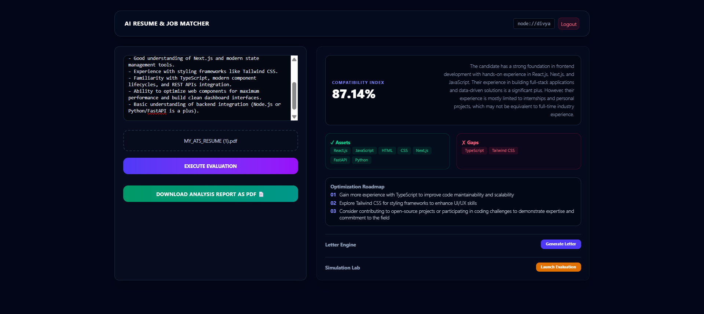
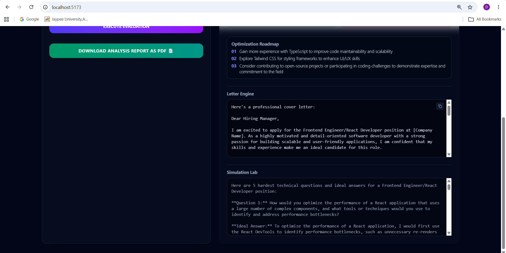

# AI Resume and Job Matcher 🚀
> An advanced, production-grade full-stack career intelligence suite that performs deep semantic context parsing and matrix analysis on candidate resumes against target job descriptions.    

---

##  Core Architecture & Features
Unlike basic keyword-matching tools, this application is built using a modern **decoupled client-server separation standard**:

- **Semantic Match Engine**: Computes high-dimensional vector embeddings using Deep Learning (`all-mpnet-base-v2`) to determine accurate **Cosine Similarity** context matches instead of simple string searches.
- **Multi-Agent System Workflows**: Integrates secondary background pipelines including a **Contextual Cover Letter Synthesizer** and an adaptive **Mock Interview Preparation Room** (generating top 5 target technical question loops).
- **Streamlined Dashboard Workbench**: Renders live operational indexes, cataloged assets, and structural gaps instantly onto a glassmorphism dark-themed UI workspace.

---

##  Tech Stack Matrix

| Layer | Technologies Used |
| :--- | :--- |
| **Frontend Client** | React.js, Vite, TypeScript, Tailwind CSS, Lucide Icons |
| **Backend Server** | FastAPI (Python), Asyncio, Uvicorn Server Architecture |
| **AI / Machine Learning** | Sentence-Transformers (BERT), Groq API Engine (Llama 3.3 70B Model) |
| **Data Parsing** | PDFMiner Infrastructure Frameworks |

---

##  Project Repository Structure
```text
AI-Resume-and-Job-Matcher/
├── main.py              # FastAPI server routes, CORS configuration & endpoints
├── processor.py         # Sentence embedding vector loops & JSON prompt templates
├── requirements.py      # Core backend dependency manifest list
├── .env                 # Local security credential keys setup (Hidden)
└── frontend-react/      # Pure React + Vite playground
    ├── src/
    │   ├── App.tsx       # Unified analytical React application UI workspace layout
    │   ├── main.tsx      # Application framework window entry point
    │   └── index.css     # Tailwind custom directive utility rules
    ├── index.html        # Client mount layout shell with Tailwind runtime injection
    └── package.json      # Node modules dependency control configuration
```

---

##  Setup & Local Installation Guide

### Prerequisites
- Python 3.10+
- Node.js v18+ & npm
- A Groq API Key (Get it from [Groq Console](https://groq.com))

### 1. Clone the Workspace
```bash
git clone https://github.com/divy686/AI-Resume-and-Job-Matcher.git
cd AI-Resume-and-Job-Matcher
```

### 2. Configure Backend Engine
Create a local `.env` file in the root directory:
```env
GROQ_API_KEY=your_actual_groq_api_key_here

Install required Python libraries:
```bash
pip install fastapi uvicorn groq sentence-transformers sklearn pdfminer.high_level python-dotenv
```
Boot up the local API Microservice:
```bash
python main.py
```
*The server will initialize the BERT model matrix and begin listening dynamically on `http://localhost:8000`*

### 3. Configure Frontend Workbench
Open a secondary independent terminal window:
```bash
cd frontend-react
npm install
```
Boot up the hot-reloading React client playground:
```bash
npm run dev
```
Open **`http://localhost:5173`** in your browser to interface with the application! 

---

##  Screenshots

###  Centralized Analytics & Compatibility Matrix


###  Automated Document Synthesis & Simulation Labs



---

