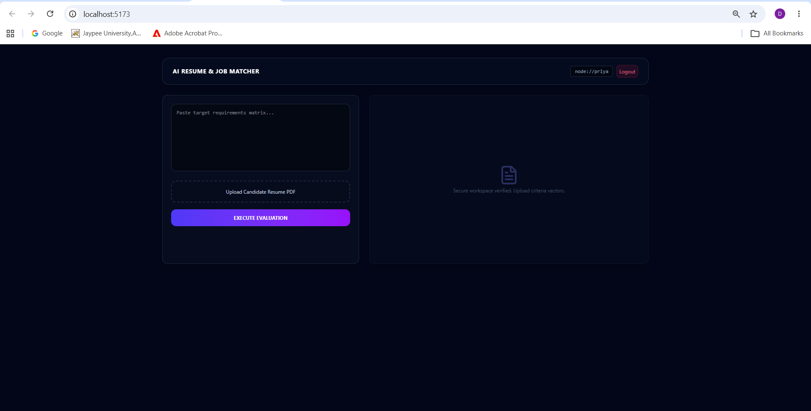
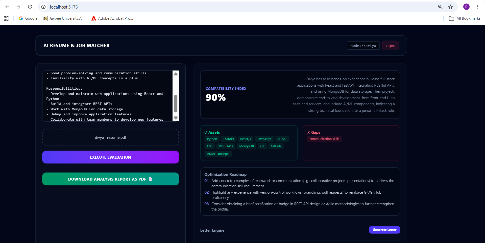

# AI Resume and Job Matcher 🚀

> A full-stack AI-powered application that analyzes resumes against job descriptions using semantic similarity, provides skill-gap insights, and generates AI-assisted career resources.

---

##  Screenshots

### Dashboard & Resume-Job Matching



### AI-Powered Workspaces



---

##  Features

* **User Authentication** — Signup and login functionality with secure authentication.
* **Resume Upload & Parsing** — Upload resumes and extract relevant information from PDF documents.
* **Job Description Analysis** — Analyze job descriptions and identify relevant skills and requirements.
* **Semantic Resume Matching** — Uses Sentence Transformers (`all-mpnet-base-v2`) and cosine similarity to compare resumes with job descriptions.
* **Skill Gap Analysis** — Identifies skills that may be missing or need improvement based on the job description.
* **AI Cover Letter Generation** — Generates personalized cover letters using the Groq API.
* **AI Mock Interview** — Provides an AI-powered interview practice experience based on the user's resume and target role.
* **PDF Reports** — Generates useful reports from the analysis results.
* **MongoDB Persistence** — Stores application and user-related data using MongoDB.

---

##  Architecture

The application follows a **decoupled full-stack architecture**:

```text
React Frontend
      ↓
FastAPI Backend
      ↓
MongoDB Database
      ↓
AI / NLP Services
      ├── Sentence Transformers
      └── Groq API
```

---

##  Tech Stack

| Layer                         | Technologies                                           |
| :---------------------------- | :----------------------------------------------------- |
| **Frontend**                  | React.js, TypeScript, Vite, Tailwind CSS, Lucide Icons |
| **Backend**                   | FastAPI, Python, Uvicorn                               |
| **Database**                  | MongoDB / MongoDB Atlas                                |
| **AI / NLP**                  | Sentence Transformers, `all-mpnet-base-v2`, Groq API   |
| **AI Model**                  | `openai/gpt-oss-120b`                                  |
| **Document Processing**       | PDFMiner                                               |
| **Authentication & Security** | JWT, password hashing                                  |
| **Development Tools**         | Git, GitHub, Postman                                   |

---

##  Project Structure

```text
AI-Resume-and-Job-Matcher/
├── main.py
├── processor.py
├── requirements.txt
├── .gitignore
├── Images/
│   ├── dashboard_metrics.png
│   └── ai_workspaces.png
└── frontend-react/
    ├── src/
    ├── public/
    ├── index.html
    ├── package.json
    ├── tsconfig.json
    └── vite.config.ts
```

---

##  Local Setup

### Prerequisites

* Python 3.10+
* Node.js 18+
* MongoDB or MongoDB Atlas
* Groq API Key

### 1. Clone the Repository

```bash
git clone https://github.com/divy686/AI-Resume-and-Job-Matcher.git
cd AI-Resume-and-Job-Matcher
```

### 2. Backend Setup

Create a `.env` file in the project root:

```env
GROQ_API_KEY=your_groq_api_key
MONGO_URI=your_mongodb_connection_string
```

Install Python dependencies:

```bash
pip install -r requirements.txt
```

Start the backend:

```bash
uvicorn main:app --reload
```

The API will run at:

```text
http://localhost:8000
```

### 3. Frontend Setup

Open another terminal:

```bash
cd frontend-react
npm install
```

Start the frontend:

```bash
npm run dev
```

The frontend will run at:

```text
http://localhost:5173
```

---

##  Environment Variables

The following environment variables are required:

| Variable       | Purpose                             |
| :------------- | :---------------------------------- |
| `GROQ_API_KEY` | Authentication for Groq AI services |
| `MONGO_URI`    | MongoDB database connection         |

> Never commit your `.env` file or expose API keys in the repository.

---

##  AI & NLP Pipeline

The application uses a combination of semantic NLP and generative AI:

1. Resume PDF is uploaded and parsed.
2. Resume content and job description are processed.
3. Sentence Transformer embeddings are generated using `all-mpnet-base-v2`.
4. Cosine similarity is used to measure semantic compatibility.
5. Relevant skills and gaps are identified.
6. Groq API is used for AI-powered career assistance such as cover letters and mock interviews.

---

##  Project Highlights

* Full-stack React + FastAPI application
* Semantic resume-to-job matching
* AI-powered career assistance
* PDF resume processing
* MongoDB-based persistence
* JWT-based authentication
* Responsive modern frontend
* REST API architecture

---

## 📄 License

This project is distributed under the MIT License.
